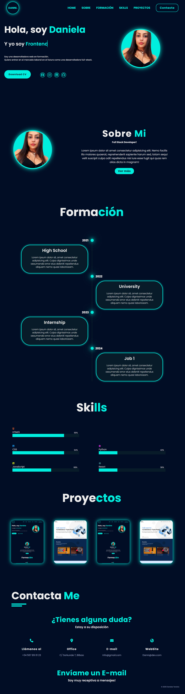
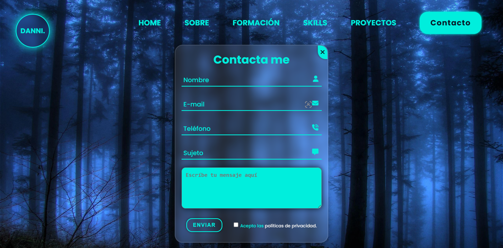

# Mi Portafolio

Proyecto Final - Inatec

  

  

- <a href="#" target="_blank">Mira el proyecto completo</a>

## 🚀 Tecnologías

Este proyecto fue desarrollado con las seguientes tecnologías:

- HTML5
- CSS 3
- Git e Github
- Metodología BEM

## 💻 Proyecto

  Este es el proyecto final del curso de desarrollo web del centro Inatec y nos propusieron que cada alumno hiciera una página estilo portafolio.
Elegí un estilo más futurista, con un contraste fuerte de colores, efecto de luz en el :hover, un menu cristal al hacer scroll y un formulario diferente.

## 🛠 Mejoras

Algunas mejoras que se pueden aplicar:

- Responsividad
- Usar JS para que la sección Proyectos sea más interesante
- Usar un deseño diferente para la foto en la sección Sobre mi

## :memo: Licença

Esse projeto está sob a licença MIT.

---

Feito com ♥ by Daniela Tenório

